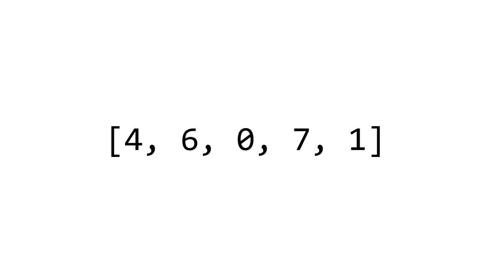

# Sorting Algorithms

## Bubble Sort

Bubble Sort is a sorting algorithm that compares two adjacent items with each other and swaps them if they are not in order. It will continuously compare and swap adjacent elements that are not in order until the array is sorted.

## Selection Sort

Selection Sort is a sorting algorithm that "splits" the list into two: the sorted and unsorted part. It takes the smallest number from the unsorted part, then "appends" it to the sorted part (by exchanging them).

## Insertion Sort

Insertion Sort is a sorting algorithm that also "splits" the list into a sorted and unsorted part. This time, it takes the first element from the unsorted part and "inserts" it into the sorted part.

