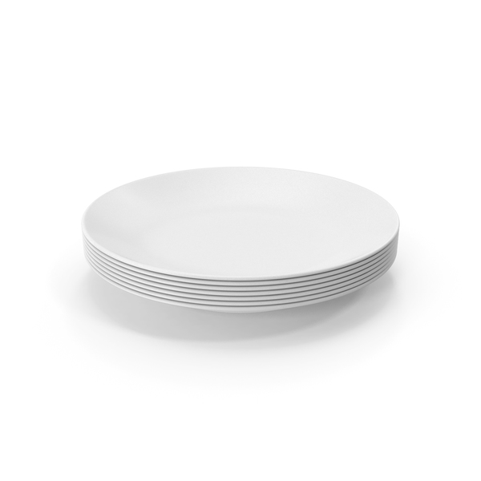

# Abstract Data Types: Stack and Queue

## Introduction

In this section, we will be tackling two abstract data types: a **Stack** and a **Queue**.

### Table of Contents

[[toc]]

# What are ADTs?

An **abstract data type**, or **ADT**, is a model for data types where a data type is defined by its behavior, possible operations on the data type, and the behavior of every operation indicated on the data type.

In other words, it is a data type where it's supposed behavior is defined, but can vary in implementation, so long as it's behavior follows how the data type is supposed to behave.

## Stack

A **Stack** is an abstract data type where items follow the last in, first out or LIFO method. In this abstract data type, you can only access the most recent "entry" at a time, which is called the "top".

To better visualize a "Stack", imagine a bunch of plates on top of each other.


<center>
	<br>
	<i>Ceramic Plates Stack PNG & PSD</i> Retrieved from PixelSquid: <a href=pixelsquid.com>pixelsquid.com</a>
</center>

Now, say that you want to take a plate (and that you are lazy). Obviously, you'd want to take a plate from the top-most one, since it would take more effort to take a plate in-between or at the bottom.

When you finish washing a plate, you'd also put it on top, since again, it would take more effort to place the plate in-between or at the bottom.

This is how Stacks work! When you take an element from the Stack, the **top-most** element is taken. When you add an element to the Stack, it is added at the **top**!

Since a Stack is an abstract data type, there are a list of operations a "Stack" must implement for it to truly be considered as one. They are as follows:

- `push(item)` - This will push an item on top of the stack.
- `pop()` - This will take the item on top of the stack and return it's value.
- `peek()` - This will "look" (peek) at the item on top of the stack and return it's value. This operation should **not** remove the item.
- `isEmpty()` - This checks if the stack is empty, returning `true` or `false` accordingly.
- `size()` - This returns the amount of items in the stack.

::: details You can click here for the Python implementation of the Stack ADT.
```py
class Stack:
	def __init__(self):
		self.items = []
	def push(self, item):
		self.items.append(item)
	def pop(self):
		return self.items.pop()
	def peek(self):
		return self.items[len(self.items) - 1]
	def isEmpty(self):
		return len(self.items) == 0
	def size(self):
		return len(self.items)
```
:::

### Stack Applications: Balanced Parentheses

A useful application of the Stack ADT is checking whether or not a given string parentheses are "balanced", meaning all parentheses properly close each other.

For practice, try to code (or imagine) how a program can use Stacks to check whether or not a given string of parentheses are balanced.

Note that hints and a solution are given below. However, it is **highly** encouraged for you to try and think of a solution *first* before opening them though!

::: details Hint 1
We know that parentheses can *contain* inner parentheses, and that these inner parentheses **must** close before the outer parentheses close. 
:::
::: details Hint 2
After evaluating the entire string, all parentheses should have been closed by then.
:::
::: details Hint 3
There should be an opening parentheses **first** before it can be closed!
:::
::: details Click to open the solution! It is **highly** encouraged for you to think of a solution *first* by opening the hints before opening this though!
From Hint 1, a Stack is practical for this problem since the **most recent** opening parentheses **must** be **closed** before the preceeding ones.

From Hint 2, we can check if the Stack has no more items left. If there are, that means that there are unclosed parentheses at the end of the string, which still makes it unbalanced.

From Hint 3, we check the Stack if there is an opening parentheses that is closed by the current closing parentheses. If there are none, that means that there are extra closing parentheses.

Here is the Python code for the solution:
```py
def balanced_parentheses(string):
	stack = Stack()

	for char in string:
		if char == "(":
			stack.push("(")

			continue

		if stack.isEmpty():
			return False

		stack.pop()

	return stack.isEmpty()
```

We iterate over the characters in the string. If the character is an opening parentheses, we push it to the stack. If not, it must be a closing parentheses, so we check if there is an opening parentheses in the stack for it to close. If there is none (`stack.isEmpty()`), we return `False`, since there is an extra closing parentheses. Otherwise, we pop from the stack, indicating a pair of parentheses being closed. 

At the end, we check if the stack is empty again. If it's not, then there are opening parentheses that are not closed, so it'll return `False`. Otherwise, the stack is empty, meaning all parentheses have been closed, returning `True`.
:::

## Queue

A **Queue**  is an abstract data type where items follow the first in, first out or FIFO method. Much like **Stack**s, in this abstract data type, you can only access the most recent "entry" at a time, which is called the "front", while newer added items are added to the back, or the "rear". 

To better visualize a "Queue", imagine the line at the cafeteria as lunch time approaches.


If you've noticed, lines follow a "first come, first serve" rule, which can be another way of saying "first in (come), first out (serve)"! When a person enters the line, the people already in the line before them should be served first before them! Could you imagine how chaotic it would be if lines followed a **Stack** rather than a **Queue**?

Anyways, the first person in line gets served first, then the second, then the third, and so on and so forth, until our line (or queue) has no more customers left to serve. This is also how a **Queue** works: people who come later are added to the "rear" of the line, while the people in "front" get served their meal.

Like Stacks, a Queue is an abstract data type, so there are a list of operations a "Queue" must implement for it to truly be considered as one. They are as follows:

- `enqueue(item)` - This will add an item on the rear of the queue.
- `dequeue()` - This will take the item on the front of the queue.
- `isEmpty()` - This checks if the queue is empty, returning `true` or `false` accordingly.
- `size()` - This returns the amount of items in the queue.

::: details You can click here for the Python implementation of the Queue ADT.
```py
class Queue:
	def __init__(self):
		self.items = []
	def enqueue(self, item):
		self.items.append(item)
	def dequeue(self):
		return self.items.pop(0)
	def isEmpty(self):
		return len(self.items) == 0
	def size(self):
		return len(self.items)
```
:::

## Deque (Double-Ended Queue)

A **double-ended Queue** or **deque** for short is an ADT combining both a **Stack** and a **Queue**, where we are able to insert and take elements from the rear (Stack) and from the front (Front).

This ADT combines behaviors from both the **Stack** and the **Queue**, allowing insertion and deletion from both ends.

When we take from or insert to the rear, we are taking the **last** element added to the double-ended queue, which follows the behavior of a **Stack**. Consequently, when we take from the front and insert to the rear, we are taking the **first** element added to the double-ended queue (at the front), which follows the behavior of a **Queue**.

::: details You can click here for the Python implementation of the Deque ADT.
```py
class Deque:
	def __init__(self):
		self.items = []
	def add_front(self, item):
		self.items.append(item)
	def add_rear(self, item):
		self.items.insert(item, 0)
	def remove_front(self):
		return self.items.pop()
	def remove_rear(self):
		return self.items.pop(0)
	def isEmpty(self):
		return len(self.items) == 0
	def size(self):
		return len(self.items)
```
:::
 
<style>
	.center {
		display: block; 
		margin-left: auto; 
		margin-right: auto;
	}

	.x50 {
		height: 50%;
		width: 50%
	} 

	.x75 {
		height: 75%;
		width: 75%
	} 
</style>