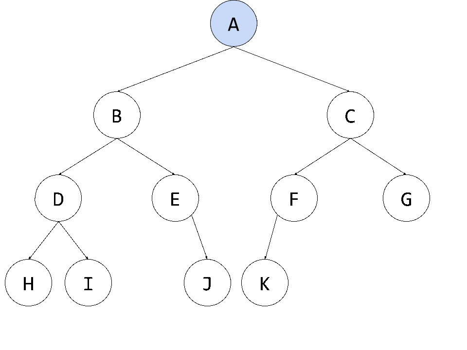
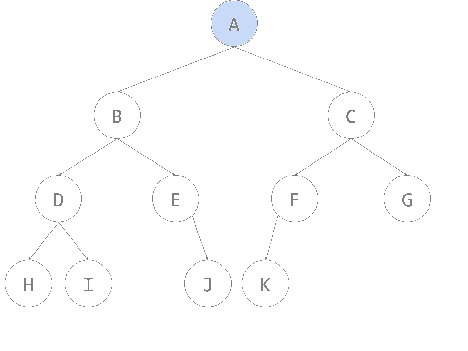
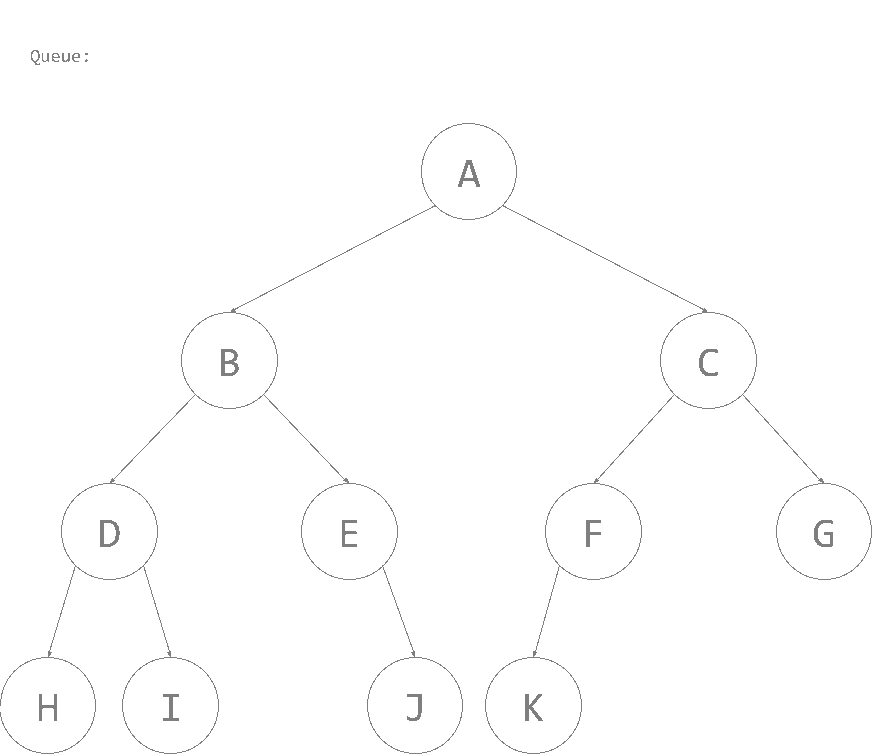

# Binary Tree Traversal

## Introduction

Now that we've discussed Trees and how they work, what if you'd want to find a specific value in a node? For arrays, this is easy: just iterate over the array. For Stacks and Queues, just continually check if the Stack or Queue is empty and continuously `pop()` or `dequeue()`, respectively. But, what about for Trees? It looks quite complex to traverse this data structure to check for a value.

In this section, we will discuss the various ways we can traverse a binary tree.

### Table of Contents

[[toc]]

## Inorder Traversal

In **Inorder** traversal, we traverse the left subtree, then the root, then the right subtree. In this traversal method, we go "up" the left subtree, then the root, then go "down" the right subtree.

Here, **blue** means the nodes that are being recursively visited, while **green** means checking the value of the node.

From the order of our "green" nodes, the resulting sequence should be: H D I B E J A K F C G

## Preorder Traversal

In **Preorder** traversal, we traverse from the root, then the left subtree, then the right subtree. In this traversal method, we go "down" in both the left subtree and the right subtree.

Again, **blue** means the nodes that are being recursively visited, while **green** means checking the value of the node.

From the order of our "green" nodes, the resulting sequence should be:  A B D H I E J C F K G

## Postorder Traversal

In **Postorder** traversal, we traverse from the left subtree, the root, then the right subtree. In this traversal method, we go "up" in both the left and right subtree, the inverse of [Preorder Traversal](#preorder-traversal).

Again, **blue** means the nodes that are being recursively visited, while **green** means checking the value of the node.

From the order of our "green" nodes, the resulting sequence should be: H I D J E B K F G C A

## Level Order Traversal (Breadth-first Search)

In **Level Order Traversal**, also known as **Breadth-first Search**, we create a [Queue](./adt-stack-and-queue.md#queue) that holds the nodes to be visited, and push the root node to the the **Queue**. While there is an item in the Queue, we continuously **dequeue** the current node and get all of it's child nodes and append it to the queue, in the order of left to right.

When there are no more child nodes, that means that the current node is a leaf, and that we've reached the end of the subtree.

Unlike the other traversal methods discussed in this section, this traversal method takes advantage of a Queue, rather than recursing on the subnodes.

Again, **blue** means the nodes that are being recursively visited, while **green** means checking the value of the node.

From the order of our "green" nodes, the resulting sequence should be: A B C D E F G H I J K