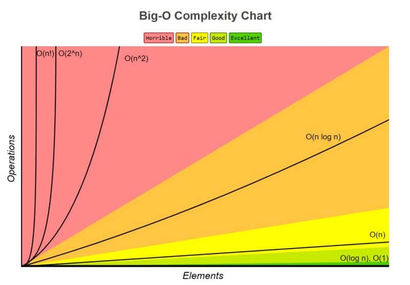

# Growth of Functions

If you want to perform a specific task, let's say doing your requirements, you would want it to be done as fast as possible, right? After all, you wouldn't want a requirement to take hours, or even days, especially when your deadline is near!

In CS, the same concept applies to functions. We don't want our functions to take incredibly long, otherwise, our code would run really slow! What about the user using our application? They'd probably get frustrated waiting for a response! In this lesson, we will tackle about the growth of functions, or most commonly known as **Big O notation**.

## Introduction

The growth of functions, most commonly denoted in Big O notation, describes the **worst** time complexity a function takes, given a certain input size.

*Complexity Growth Illustration.* Retrieved from bigocheatsheet: [https://www.bigocheatsheet.com/](https://www.bigocheatsheet.com/)

## How does it work?

You may see different "arguments" to $O$ like $n\,log\,n$, $n^2$, $n!$, $2^n$, etc. These arguments describe the function's complexity as the input size grows.

Here, a **lesser** complexity is better, since it means that the function takes lesser time in comparison to it's competitors, meaning it is more efficient time-wise.

For instance, take $O(n^2)$ and $O(n)$. The function with the best time complexity out of the two is the $O(n)$ one, since as the input size grows, the time complexity would be just the input size, rather than the input size, squared.