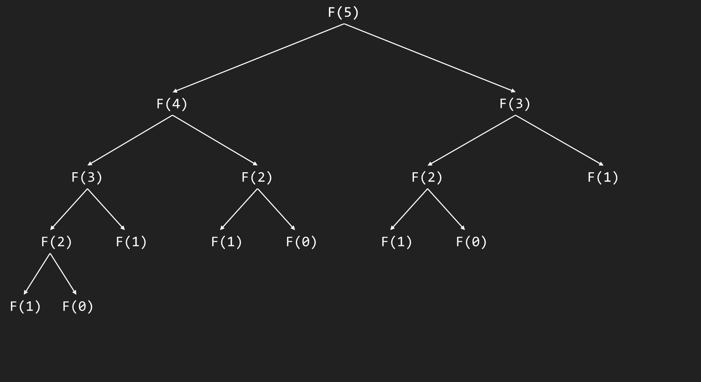

# Measuring Algorithm Growth (Level 2)

::: tip
This is a "Level 2" topic, which means it is either: a topic mentioned, but not fully discussed, or a topic that extends upon previous knowledge, without actually being in the curriculum. This is here to serve as extra reading, and can be skipped without having any effect on the normal topics.

Before you proceed to this topic, it is heavily suggested that you read [Growth of Functions](./growth-of-functions.md) first, as this topic will require you to have a proper and working understanding of it.
:::

## Introduction

> *This page is about the analytical way of obtaining a function's Big O. For the mathematical one, see [Big O, Big Θ and Big Ω](./big-o_big-theta_big-omega.md).*

In the previous topic, we learned about the growth of functions. However, we still need a proper way to measure the growth of a function. In this lesson, we will learn how to measure the growth of a function.

Here, our input size is denoted as $n$.

### Table of Contents
- [Introduction](#introduction)
	- [Table of Contents](#table-of-contents)
- [Constant time functions: $O(1)$](#constant-time-functions)
- [Logarithmic time functions: $O(log~n)$](#logarithmic-time-functions)
- [Linear time functions: $O(n)$](#linear-time-functions)
- [Linearithmic time functions: $O(n~log~n)$](#linearithmic-time-functions)
- [Polynomial time functions: $O(n^x$)](#polynomial-time-functions-)
- [Exponential time functions: $O(x^n)$](#exponential-time-functions)
- [Factorial time functions: $O(n!)$](#factorial-time-functions)

## Constant time functions: $O(1)$

In constant time, or $O(1)$, the function's time complexity remains the same **regardless** of the input size. For instance, let us take a look at the function below:

```py
def convert(celsius):
	return (celsius * 9/5) + 32
```

Here, even if we pass `100000` or `1` to the `convert()` function, it still performs the same operation on the number: multiply it by `9/5` (`1.8`) and add `32` to it. Our function is **constant** regardless of the argument. This is also why our "argument" does not have $n$: because it won't change based on $n$.

## Logarithmic time functions: $O(log~n)$

In logarithmic time, or $O(log~n)$, the function's time complexity depends on the input size. Algorithms that have logarithmic time *tend* to perform a "split", like **binary search**.

In **binary search**, the array is continuously "split" until the number is found or not. We represent this as a logarithm since it describes the amount of times you can divide $n$ by $x$, in this case $2$, before it becomes $1$. 

::: tip
This is also why logarithms "undo" exponents. If $2$ multiplied by itself $4$ times, or $2^4$, is equal to $16$, then the number of times you can divide $16$ by $2$ until it becomes $1$ should be $4$, which is the exact result of $log_2(16)$.
:::

```py
def binary_search(array, target) -> int:
	left = 0
	right = len(array) - 1

	while left <= right:
		mid = (left + right) // 2
		value = array[mid]

		if value == target:
			return mid
		
		if value > target:
			right = mid - 1
		else:
			left = mid + 1

	return -1
```

It's quite hard to see on paper, but the giveaway here is both `right = mid - 1`, `left = mid + 1`, and `mid = (left + right) // 2`. `right` and `left` represent whats "left" of the array, while `mid` would be the "split".

<!-- Perhaps some visual aids can help again: <insert "math edit" of the binary search "split"> -->

## Linear time functions: $O(n)$

In linear time, or $O(n)$, the function's time complexity depends on the input size. Algorithms like these tend to iterate over the input, like an array. A great example is linear search. 

In linear search, you compare the **entire** array to see if the value exists in the array. The reason why it's $O(n)$ is because it's worst case is the value being at the end of the array or the value not existing at all, both cases meaning you've iterated over the entire array.

```py
def linear_search(array, target) -> int:
	for i in range(len(array)):
		if array[i] == target:
			return i
		
	return -1
```

As you can see, we iterate over the entire array to see if `target` is in it. If it's at the end or not in the array, then we iterated over the entire array, giving a worst time complexity of `O(1)`.

## Linearithmic time functions: $O(n~log~n)$

In linearithmic time, or $O(n~log~n)$, the function's time complexity depends on the input size. Algorithms like these tend to combine both concepts from linear time and logarithmic time.

As we've discussed in logarithmic time, the algorithm *tends* to perform a split, while in linear time, the algorithm *tends* to iterate over the entire array.

An example of a linearithmic time algorithm is **merge sort**. In merge sort, the array is recursively **divided** (split) and is put back together, sorted.

Firstly, we will go over the full merge sort algorithm, and how it works. We will first, start with it's code:

```py:collapsed-lines=12
def merge_sort(array):
	def divide_and_sort(array):
		if len(array) <= 1:
			return array

		mid = len(array) // 2

		return merge(divide_and_sort(array[:mid]), divide_and_sort(array[mid:]))

	def merge(left, right):
		result = []

		iL = 0
		iR = 0

		while iL < len(left) and iR < len(right):
			if left[iL] < right[iL]:
				result.append(left[iL])
				iL += 1
			else:
				result.append(right[iR])
				iR += 1

		result.extend(left[iL:])
		result.extend(right[iR:])

		return result

	return divide_and_sort(array)
```

You may know that merge sort employs a **divide-and-conquer** approach, which can be seen here. Our "divide" is the `divide_and_sort()` function, while our "conquer" is the `merge` function.

Let's start with the `divide_and_sort` function.

```py
def divide_and_sort(array):
	if len(array) <= 1: # [!code focus]
		return array # [!code focus]

	mid = len(array) // 2

	return merge(divide_and_sort(array[:mid]), divide_and_sort(array[mid:]))
```

This first part checks if the array's length is at least `1`, and if it is, it means the array has been split to a single element, then returns it.

```py
def divide_and_sort(array):
	if len(array) <= 1:
		return array

	mid = len(array) // 2 # [!code focus]

	return merge(divide_and_sort(array[:mid]), divide_and_sort(array[mid:]))
```

If the array has not been split down to a single element, we get the mid point of the array and split the array from there.

```py
def divide_and_sort(array):
	if len(array) <= 1:
		return array

	mid = len(array) // 2

	return merge(divide_and_sort(array[:mid]), divide_and_sort(array[mid:])) # [!code focus]
```

We split the array into two halves using the `array[start:end]` syntax, pass them both into `divide_and_sort`, then pass their results to the `merge` function.

Now, we go onto the `merge` function.

How does merge sort, even, merge? Here, we know that the arrays are initially split into single elements. If they are, we just need to intially sort their elements so that the resulting array from merging is sorted.

```py
def merge(left, right):
	result = [] # [!code focus]
	iL = 0 # [!code focus]
	iR = 0 # [!code focus]

	while iL < len(left) and iR < len(right):
		if left[iL] < right[iL]:
			result.append(left[iL])
			iL += 1
		else:
			result.append(right[iR])
			iR += 1

	result.extend(left[iL:])
	result.extend(right[iR:])

	return result
```

We declare the variables needed for merging the two arrays: the `result`, `iL` and `iR`. `result` will contain the sorted version of the array, while `iL` and `iR` would be our "pointers" to the current element of the array we are reading, where we initially start at `0`.

```py
def merge(left, right):
	result = []
	iL = 0
	iR = 0

	while iL < len(left) and iR < len(right): # [!code focus]
		if left[iL] < right[iL]:
			result.append(left[iL])
			iL += 1
		else:
			result.append(right[iR])
			iR += 1

	result.extend(left[iL:])
	result.extend(right[iR:])

	return result
```

Our conditions here make it so that if either "pointer" hasn't reached the end yet, we keep on sorting. If a pointer has reached the length of it's array, we know that the array's values have all been appended.

```py
def merge(left, right):
	result = []
	iL = 0
	iR = 0

	while iL < len(left) and iR < len(right):
		if left[iL] < right[iL]: # [!code focus]
			result.append(left[iL]) # [!code focus]
			iL += 1 # [!code focus]
		else: # [!code focus]
			result.append(right[iR]) # [!code focus]
			iR += 1 # [!code focus]

	result.extend(left[iL:])
	result.extend(right[iR:])

	return result
```

We know that the two arrays are sorted. If the value of the left element is lower than that of the right element, we append the left element and push the left "pointer" forward. Otherwise, the right element has a lower value, meaning we append that instead and push the right "pointer" forward.

```py
def merge(left, right):
	result = []
	iL = 0
	iR = 0

	while iL < len(left) and iR < len(right):
		if left[iL] < right[iL]:
			result.append(left[iL])
			iL += 1
		else:
			result.append(right[iR])
			iR += 1

	result.extend(left[iL:]) # [!code focus]
	result.extend(right[iR:]) # [!code focus]

	return result
```

Lastly, append the remaining items to the result. Since the loop will terminate if either left or right array reaches it's end, we know that the remaining items are higher than the last element in the `result` array, meaning we can freely append the remaining elements.

Now, the important question: why is this $O(n~log~n)$, and not $O(n)$ or $O(log~n)$? The answer lies in the splitting and merging. For every "split", you iterate over the split arrays and merge them to create a sorted array. An iteration happens **with** the split, meaning that for **every split**, an **iteration** is performed, meaning the time complexity would be $O(n~log~n)$.

## Polynomial time functions: $O(n^x$)

In polynomial time, or $O(n^x)$, the function's time complexity depends on the input size. Algorithms like these tend to employ an "iteration-for-iteration" approach.

Here, we will use the concept from merge sort, where for **every split**, an **iteration** is performed, meaning it's time complexity would be $O(n~log~n)$.

For this, a great example would be **bubble sort**. In bubble sort, you continuously proceed to swap two elements together until the entire array is sorted.

```py
def bubbleSort(array):
    for i in range(len(array)):
        swapped = False

        for j in range(0, len(array) - (i + 1)):
            if array[j] > array[j + 1]:
                temp = array[j]

                array[j] = array[j + 1]
                array[j + 1] = temp
                swapped = True

        if (not swapped):
            break
```

As you can see here, an **iteration** is performed **per iteration**, meaning that for every **iteration**, another **iteration** happens. This results in a complexity of $O(n \times n)$, which can be simplified to $O(n^2)$.

## Exponential time functions: $O(x^n)$

In exponential time, or $O(x^n)$, the function's time complexity depends on the input size. Algorithms like these tend to be recursive functions. A great example is the **Fibonacci number**.

Assuming that the Fibonacci number function employs [naive recursion](./dynamic-programming.md#naive-recursion) with no [Dynamic Programming](./dynamic-programming.md) involved, it would have a time complexity of $O(2^n)$.

```py
def fib(n):
	if n == 0 or n == 1:
		return n

	return fib(n - 1) + fib(n - 2)
```

Why is it $O(2^n)$? It is because of it's recursive definition.

```py
def fib(n):
	if n == 0 or n == 1:
		return n

	return fib(n - 1) + fib(n - 2) # [!code focus]
```

When you calculate a number in the Fibonacci sequence with this function using `fib(n)`, **two** more `fib` functions are "spawned": `fib(n - 1)` and `fib(n - 2)`, and for **each** of those functions, **two** more `fib` functions are also spawned. This behavior results in the recursion tree exponentially increasing by `2`.

Let's look at it's recursion tree.



While the actual recursion tree doesn't follow our rule at the end, it is evident that our calls increase exponentially by $2$ from the first "level" to the third "level". 

## Factorial time functions: $O(n!)$

Finally, in factorial time, or $O(n!)$, the function's time complexity depends on the input size. Algorithms like these tend to be functions that explore **all permutations** or **all possible combinations**. For example, generating all the possible ways an array can be sorted.

```py
def permutate(array):
	if len(array) <= 1:
		return [array]
	
	result = []
	
	for i in range(len(array)):
		element = array[i]

		remaining = array[:i] + array[i + 1:]

		for perm in permutate(remaining):
			result.append([element] + perm)

	return result
```

Before we find out how this has a time complexity of $O(n!)$, we need to first explain *how it works*.

```py
def permutate(array):
	if len(array) <= 1: # [!code focus]
		return [array] # [!code focus]
	
	result = []
	
	for i in range(len(array)):
		element = array[i]

		remaining = array[:i] + array[i + 1:]

		for perm in permutate(remaining):
			result.append([element] + perm)

	return result
```

If the array's length is `1`, we return it since there are no more possible permutations left for it: $1! = 1$

```py
def permutate(array):
	if len(array) <= 1
		return [array]
	
	result = [] # [!code focus]
	
	for i in range(len(array)):
		element = array[i]

		remaining = array[:i] + array[i + 1:]

		for perm in permutate(remaining):
			result.append([element] + perm)

	return result
```

Otherwise, we create an array containing all the possible permutations.

```py
def permutate(array):
	if len(array) <= 1
		return [array]
	
	result = []
	
	for i in range(len(array)): # [!code focus]
		element = array[i] # [!code focus]

		remaining = array[:i] + array[i + 1:]

		for perm in permutate(remaining):
			result.append([element] + perm)

	return result
```

Here, we iterate over the elements of the array.

```py
def permutate(array):
	if len(array) <= 1
		return [array]
	
	result = []
	
	for i in range(len(array)):
		element = array[i]

		remaining = array[:i] + array[i + 1:] # [!code focus]

		for perm in permutate(remaining):
			result.append([element] + perm)

	return result
```

We exclude the number we are currently from permutated by using the `array[start:end]` syntax and excluding the index of that element. As for why we exclude it, we will explain it later on.

::: tip
The `array[start:end]` syntax returns a copy of the array from the element at `start` (inclusive) all the way to `end` (exclusive).

For instance, in the array below:

```py
array = [1, 3, 5, 7, 9]
```

Creating a copy using `array[0:3]` will include all array elements from index `0` (inclusive) to `3` (exclusive). That means that the included elements are `1`, `3` and `5`, but not `7`, since the end is exclusive.
:::

```py
def permutate(array):
	if len(array) <= 1
		return [array]
	
	result = []
	
	for i in range(len(array)):
		element = array[i]

		remaining = array[:i] + array[i + 1:]

		for perm in permutate(remaining): # [!code focus]
			result.append([element] + perm) # [!code focus]

	return result
```

We create permutations on the remaining elements, combining every single permutation with the current element.

If you still don't get the algorithm's concept, perhaps a little bit of visual aids can help:

<iframe width="640" height="360" class="center" src="https://streamable.com/e/cmoifz" frameborder="0" allow="fullscreen" allowfullscreen></iframe>

Now that you get how the algorithm works, it's time to explain *why* it's $O(n!)$

As you can see, either from the code or the visual explanation, a "focus element" or "current element" is selected and the permutations happen on the elements of the remaining array. Once the permutations are created, the focus element is added as the first index.

For example, if we wanted to get all possible permutations of the array `[1, 2, 3]`, we will iterate over the array for our **first** focus element. Once we have our first focus element, let's say `1`, we remove it and get the possible permutations for `2` and `3`. 

Now, the same concept applies, we get the second focus element, which is, let's say `2`, and create permutations from the remaining elements. Since the remaining elements are just `[3]`, there are no more permutations, meaning that when we start with `2`, `[2, 3]` is our only possible permutation. We move to the next element, `3`, and make that the second focus. Now, the remaining elements is just `[2]`, with it's possible permutation being `[3, 2]`.

We now have 2 permutations: `[2, 3]` and `[3, 2]`. From our previous approach, we know that these are the valid permutations **if** `1` is the starting number. Therefore, our permutations for when `1` is the focus number is: `[1, 2, 3]` and `[1, 3, 2]`. We do the same thing over and over again, iterating and generating permutations until we reach the end of the original array.

Do you remember the definition of a factorial? In case you forgot, the definition of a factorial is:

$$n! = 1 \times 2 \times ... \times (n - 2) \times (n - 1) \times n$$

However, for this function, we will focus on it's alternate definition, which is defined as:

$$n! = n \times (n - 1)!$$

Our array permutation function does the exact same thing! We start with a "focus" ($n$), then generate all possible permutations without the focus ($n - 1$), adding the focus as our start after, which would be $n \times (n - 1)!$, the same as the factorial definition!

<!--

Keep fastest growing term
Drop constants

Let f ang g be functions of n where n is natural no denoting ssize or steps of the algorithm then

f(n) = O(g(n))
IFF
f(n) = c.g(n)

1. where tf is c from?
2. why 2 values of n?
3. wtf is this formula for

-->