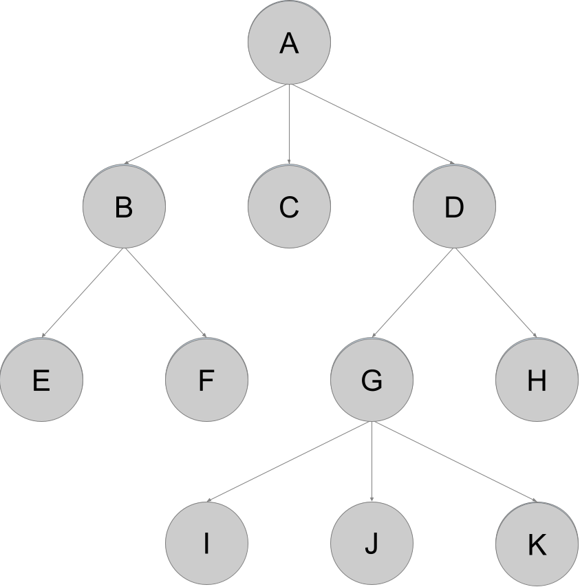
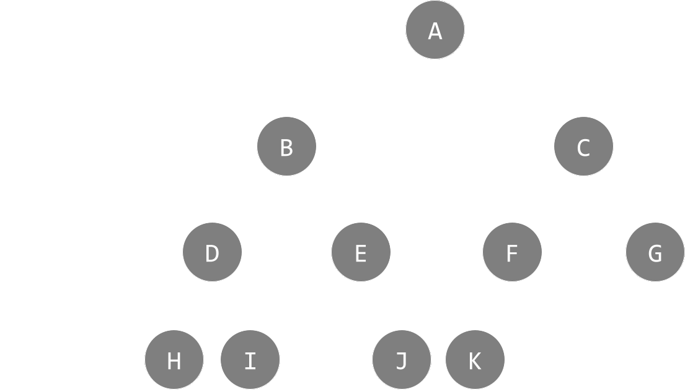

# Trees

## Introduction

### Table of Contents

[[toc]]

## Data Structure

A tree is a hierarchical data structure that consists of various "nodes" connected by "edges".

While it may not look like one, you can flip the direction of the image and see a "tree".

Here, our "nodes" are the *circles* that contain various letters, while our "edges" are the arrows pointing to other "nodes".

## Definition of Terms

Here, we will formally define the terms used in a tree data structure for you to understand what they may refer to when talking about trees.

- Node - A **node** is a container holding a key or value. It also points to it's *child* nodes.
- Edge - An **edge** is the link connecting one node to another. These are commonly represented as *arrows*.
- Root - A **root**, or **root node**, is the first node in a tree.
- Parent node - A **parent node**, or **internal node**, is a **node** that has an edge connecting to a bottom node, commonly referred to as a **child node**
- Child node - A **child node** is a node located below a certain node connected by an edge.
- Leaf - A **leaf** or **leaf node** is a node that does not connect to any child nodes.
- Ancestors - Are nodes on the path from the current node to the root.
- Descendants - Are nodes on the path from the current node to a leaf.
- Subtree - Represents the descendants of a node.
- Visiting - Checking the value of a node.
- Traversing - Passing through nodes in a specific order.
- Levels - The "generation" of a node. If the root node is at level 0, then its next child node is at level 1, its grandchild is at level 2, and so on. Basically, it's how "down" the node is from the root.
- Degree of a node - The total amount of branches (valid edges) the node has.
- Height of a node - The number of edges from the current node to the deepest leaf node.
- Depth of a node - The number of edges from the current node to the root node.
- Height of a tree - The number of edges from the root node to the deepest leaf node.
- Forest - A collection of unjoined trees. (multiple trees)

