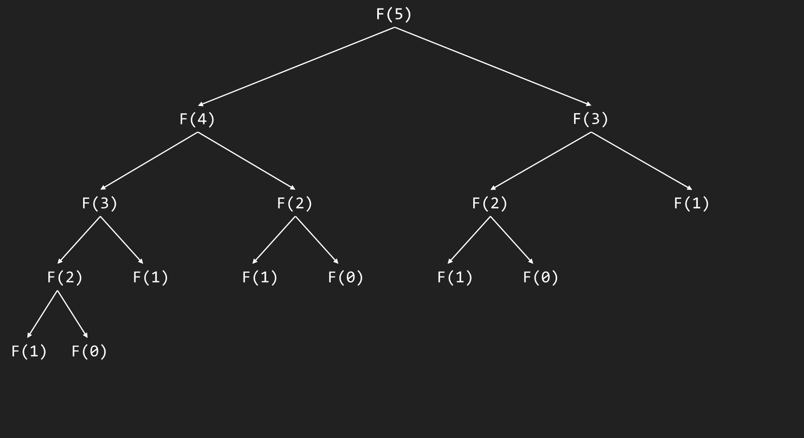
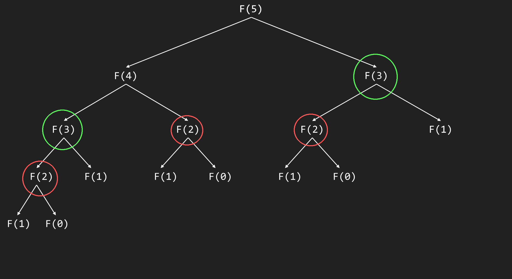
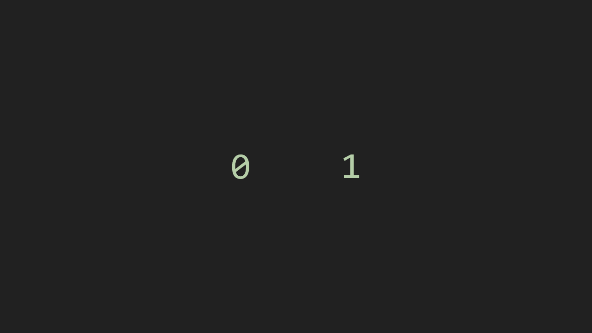

# Dynamic Programming (Level 2)

::: tip
This is a "Level 2" topic, which means it is a topic mentioned, but not fully discussed. This is here to serve as extra reading, and can be skipped without having any effect on the normal topics.

Before you proceed to this topic, it is heavily suggested that you read [Recursion](../2/recursion.md) first, as this topic will require you to have a proper and working understanding of it.
:::

What is Dynamic Programming? It is a problem-solving approach that involves simplifying a complex problem into smaller subproblems and optimizing how the complex problem is solved, normally by storing their solutions. It's a little hard to get at first, but hopefully, with a few visual aids, by the end of this topic, you'd have a good amount of knowledge on Dynamic Programming.

## Introduction

As I've mentioned above, Dynamic Programming involves **simplifying a complex problem into smaller subproblems** and **optimizing how the complex problem is solved**. To get started, we will first tackle the part of "simplifying a complex problem into smaller subproblems".

This is where [Recursion](../2/recursion.md) comes in. In our discussion on Recursion, we explained that it is an occurence that happens when a process depends on a simpler or previous version of itself. Here, our "smaller subproblems" will be the base and recursive case, which we will optimize.

## Problem

For this topic, we will be using the **Fibonacci Sequence** as the problem to be solved, thanks to it's relatively easy complexity in the topic of Dynamic Programming.

## Naive Recursion

This isn't really an explicit Dynamic Programming approach, but rather an approach to start implementing Dynamic Programming.

For this example, let us use our Fibonacci Sequence code from the [Recursion](../2/recursion.md) topic.

```py
def fib(n):
	if n == 0 or n == 1:
		return n

	return fib(n - 1) + fib(n - 2)
```

If we input a value of 5 to this function, the recursive calls would look like this:



This is a recursion tree, and it's useful in visualizing the recursive calls a function does. 

Now, what if we input a value like 35, or 50? Can you imagine how big this recursion tree would be? What about the running time? How slow would that be?

If you are a keen observer, you'd notice that there are multiple repeated function calls in this recursion tree.



Since we already know the function values of these inputs when we run them for the first time, it'd be redundant to perform the same calculation again. This is where we can use Dynamic Programming to **optimize how the complex problem is solved**.

## Top-Down (Memoization)

The top-down approach or **memoization** involves starting from the main problem and recursively solve subproblems while storing their results. Since we store their results, we can use the stored result as our output instead of computing it again, and is the reason why this approach is called top-down: because we are working from the top all the way down to our base cases.

To implement this approach, we need to make a slight adjustment to our original `fib` function.

```py
def fib(n):
	memo = {}

	def inner_fib(n):
		if n == 0 or n == 1:
			return n

		return fib(n - 1) + fib(n - 2)

	return inner_fib(n)
```

First, we create a nested `inner_fib` function to handle the recursion and move our original function logic there. Next, we create an outer `fib` function that holds the **dictionary** variable called `memo` to store the computed values. Lastly, we pass `n` to the `inner_fib` function and return it's value. 

::: tip
A **dictionary** is a data structure that store key-value pairs, where each key corresponds to a specific value. We will be taking advantage of this key-value structure to store our input (the key) and it's corresponding computed value (the value).

If you want to read more, you can check out the [Python Tutorial](https://docs.python.org/3/tutorial/) page on the [Dictionary](https://docs.python.org/3/tutorial/datastructures.html#dictionaries)
:::

Now, we need to add a way to store our computed value to the `memo` dictionary. We can use this by using the `dict[key]` syntax and setting it to our computed value.

```py
# ...

def inner_fib(n):
	if n == 0 or n == 1:
		return n
		
	memo[n] = fib(n - 1) + fib(n - 2)

	return memo[n]

# ...
```

Here, `n` is our key, while the `value` is the value associated with the key `n`.

This is good and all, but we are currently only storing values to the dictionary, making it useless. Now, we will add a way to use the computed values from the dictionary. We can do this by checking if the key `n` is already in the dictionary using the `in` keyword. If the key is in the dictionary, we know that it's value has already been computed, so we return the previously computed value instead of computing it again.

```py
# ...

def inner_fib(n):
	if n == 0 or n == 1:
		return n
	elif n in memo:
		return memo[n]
		
	memo[n] = fib(n - 1) + fib(n - 2)

	return memo[n]

# ...
```

Now, our function should look like this.

```py
def fib(n):
	memo = {}

	def inner_fib(n):
		if n == 0 or n == 1:
			return n
		elif n in memo:
			return memo[n]

		memo[n] = inner_fib(n - 1) + inner_fib(n - 2)

		return memo[n]

	return inner_fib(n)
```

With this optimization, our function would only calculate the value of `n` if it hasn't been calculated yet. This **greatly** decreases the computations needed for the `fib` function, allowing you to calculate higher values of `n` faster. However, this is still far from perfect, but is an amazing start at decreasing the amount of computations needed for our `fib` function.

## Bottom-up (Tabulation)

While the Top-down approach or Memoization is a good way to optimize our Fibonacci function by storing all the previously computed values to avoid multiple computations for the same value, there is a small problem with it: the recursive call limit. In Python, the recursion limit is `1000`, which means that if a function calls itself more than 1000 times, a `RecursionError` occurs. Luckily, there is another approach we can take: **Tabulation**.

The bottom-up approach or **tabulation** involves iteratively solving the subproblems starting from our base cases to build up an array of values to the solution of the problem.

For this approach, we will have a slightly different implementation. Firstly, we will start with this:

```py
def fib(n):
	values = [0, 1]

	return values[n]
```

Bottom-up or **tabulation** involves **building** up an **array of values** to the solution of the problem. Here, we've started with our base cases: `0` and `1`.

Now, we will perform the other part, which is to iteratively solve the subproblems.

We can do this by using a `for` loop, starting from `2` (the first recursive case) all the way to `n + 1`. Why `n + 1`? It's because the `range()` function creates a list of numbers from `start` (inclusive) to `end` (exclusive). We shift `end` by adding `1` so that `n` itself is included in the list of numbers.

```py
def fib(n):
	values = [0, 1]

	if n > 2:
		for i in range(2, n + 1):
			pass

	return values[n]
```

Here, we added a condition of `n > 2`. Since `0` and `1` are our base cases, we can just pass them directly.

If you've noticed, we added a `pass` statement. This is because we haven't explained how we would build the array yet! To build our array of values, we can use the recursive definition of the Fibonacci sequence: 

$$
F_n = F_{n-1} + F_{n-2}
$$

With that, the way we build our array of values will be easy to understand!

If you still don't get it, perhaps a little bit of visual aids can help:


As you can see here, with every iteration, we relied on the previous two numbers of the Fibonacci sequence to compute for the current one.

In our `for` loop, we take the previous and second-previous Fibonacci number using `values[n - 1]` and `values[n - 2]`, respectively, then append the result to the `values` array.

```py
def fib(n):
	values = [0, 1]

	if n > 2:
		for i in range(2, n + 1):
			values.append(values[n - 1] + values[n - 2])

	return values[n]
```

## Constant-space Bottom-up (Constant-space Tabulation)

Now that we've optimized our Fibonacci function even further by removing recursion and using a simple `for` loop instead, our function should be very optimal, time complexity wise. We can optimize it **even further** by reducing our space complexity. 

For the tabulation and memoization approach, we have a space complexity of `O(n)`, with `n` being all positive integers from `2` to `n`. We have a space complexity of `O(n)` in both approaches as our dictionary (for memoization) or array (for tabulation) grows as our input grows, either by storing their values (memoization) or building up values to the solution (tabulation).

In this approach, we will still build up our values to the solution, **but** with some changes so that our new function runs in **constant** space, which means it will **only** use that much space **every time** it is ran.

For now, our `fib` function looks like this:

```py
def fib(n):
	values = [0, 1]

	if n > 2:
		for i in range(2, n + 1):
			values.append(values[n - 1] + values[n - 2])

	return values[n]
```

As you can see, we have an array of `values` that we use to build up to the solution of the problem. However, as you've seen in our visual explanation before, you can notice that we're only using the previous two elements to build the solution, with the rest being unused. We can take advantage of this fact and use it to our advantage to achieve a constant-space Fibonacci solution.

```py
def fib(n):
	if n == 0 or n == 1:
		return n

	prev = 1
	second_prev = 0

	for i in range(2, n + 1):
		prev, second_prev = second_prev, prev + second_prev

	return prev + second_prev
```

Here, we've removed our `values` array and replaced it with a `prev` and `second_prev` variable; `prev` representing $F_{n-1}$ and `second_prev` representing $F_{n-2}$.

We keep our `for` loop and, instead of pushing to an array, perform a **multiple assignment**, assigning `second_prev` to `prev` and `prev + second_prev` to `prev`. We assign the **current** `prev` to `second_prev` since it's value for the next Fibonacci number would be $F_{n-2}$, as it's currently $F_{n-1}$, then we assign `prev + second_prev` as `prev` since it's value for the next Fibbonacci number would be $F_{n-1}$.

If you still don't get it, perhaps a little bit of visual aids can help:



Now, our Fibbonacci function is very optimized, having a space complexity of $O(1)$ and a time complexity of $O(n)$.

This is how useful Dynamic Programming can be! By using Dynamic Programming, we were able to significantly reduce the time and space complexity of our Fibonacci function, making it significantly faster!

<style>
	.center {
		display: block; 
		margin-left: auto; 
		margin-right: auto;
	}

	.x50 {
		height: 50%;
		width: 50%
	} 

	.x75 {
		height: 75%;
		width: 75%
	} 
</style>